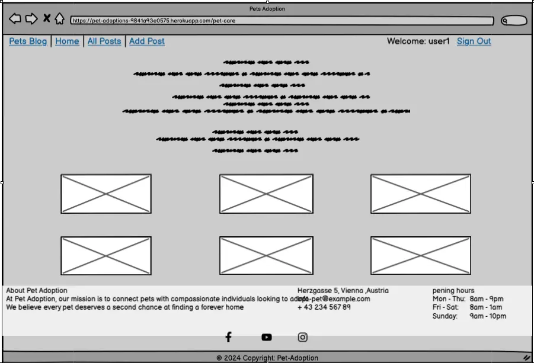

# Pet Adoption

[](https://github.com/Mustafa-Vienna/PetAdoption/commits/main)
[](https://github.com/Mustafa-Vienna/PetAdoption/commits/main)
[](https://github.com/Mustafa-Vienna/PetAdoption)


## Pet Adoption Platform

**Pet Adoption** is a Django-based platform for pet adoption, designed to connect people who are looking to re-home pets with potential adopters. This web application offers an easy and user-friendly way for users to post pet listings, browse available pets, and manage inquiries. Our goal is to support pet adoption, encourage responsible pet ownership, and help every pet find a loving home.

### Project Overview

The Pet Adoption application enables users to view available pets, post pet listings, and interact with potential adopters. Built with Django and Bootstrap, the project focuses on creating an intuitive experience that makes it simple for users to connect with pets in need of a new home.

[Live Demo](https://pet-adoptions-9841a93e0575.herokuapp.com/)


### Key Features

- **User Registration and Authentication**

  - Users can register, log in, and log out.

- **Pet Listing with Add, Update, and Delete Options**

  - Users can create, update, and delete posts for pets they wish to give away.
  - Each post includes images, descriptions, and tags, helping adopters find pets that match their preferences.

- **Detailed Pet Profiles with Images, Descriptions, and Interaction Options**

  - Each pet listing provides a detailed profile view with images, descriptive tags, and user comments.
  - Users can "like" posts by clicking a heart icon to show interest, and they can leave comments for further inquiries.
  - Each post displays the author's name. When users hover over the author's name, a tooltip reveals their email address, providing an additional way for potential adopters to connect with pet owners directly and securely.

- **Enhanced User Interaction on Posts**

  - Users can engage with posts through likes and comments, creating a more interactive platform for pet adoption.
  - Comments allow potential adopters to ask questions directly under each post, facilitating communication between pet owners and adopters.

- **Admin Panel for Monitoring and Management**

  - An admin panel enables administrators to manage user posts, monitor platform activity, and ensure content quality and compliance.

- **Responsive Design**
  - The platform is optimized for mobile, tablet and desktop devices, ensuring a seamless experience across different screen sizes.
  

## contents

1. [Features](#features)
2. [User Experience (UX)](#user-experience-ux)
   - [Design Choices](#design-choices)
   - [Typography](#typography)
   - [Imagery](#imagery)
   - [User Stories](#user-stories)
   - [Wireframes](#wireframes)
3. [Information Architecture](#information-architecture)
   - [Flowchart](#flowchart)
   - [Database Schema Diagram](#database-schema-diagram)
4. [Technologies Used](#technologies-used)
5. [Agile Methodology](#agile-methodology)
   - [Kanban Workflow](#kanban-workflow)
   - [Project Evolution](#project-evolution)
6. [Version Control](#version-control)
7. [Deployment](#deployment)
8. [Testing](#testing)
9. [Known Issues and Future Features](#known-issues-and-future-features)
10. [Credits](#credits)
   - [Resources Used](#resources-used)
   - [Code Used](#code-used)
   - [Acknowledgements](#acknowledgements)

## Features

### Existing Features

1. **User Registration and Authentication**

   - Users can sign up, log in, and log out of their accounts with the help of `crispy_form_tag` for a smooth registration experience.
   - User profiles display a list of posted pets associated with each account, but there are no options to edit, reset, or change account details.

2. **Pet Listing Management**

   - Authors (the users who create posts) can add detailed pet profiles with properties including `title`, `pet_name`, `pet_age`, `excerpt`, `image`, and `content`.
   - Only the author of a post can edit or delete their own listings. These options are not available to other registered users or visitors.

3. **Post Interactions (Likes and Comments)**

   - Registered users and authors can like posts by clicking a heart icon to show interest.
   - Both authors and registered users can leave comments on posts to facilitate discussions and inquiries.
   - Visitors (non-registered users) can browse posts and view comments as well as the like counts, but they cannot engage by liking or commenting.

4. **Admin Dashboard**

     **Admin users have access to a comprehensive dashboard that provides full control over managing the platform. They can:**

      - Create, update, and delete comments, likes, tags, and user details.
      - Manage users, including account status and permissions.
      - Oversee platform activity to maintain a safe and supportive environment.

5. **Responsive Design**
   - The website is fully responsive, ensuring an optimal user experience across all devices, including mobile and desktop views.

[Go to Contents](#contents)


## User Experience (UX)

### Design Choices

#### Color Scheme

The color palette is crafted to evoke a warm, friendly, and welcoming atmosphere for users, with shades that convey trust, approachability, and growth. The primary colors include deep blues and greens to establish reliability, with coral red accents for calls-to-action that stand out, and soft neutral tones to create a calm backdrop. Each color was selected to enhance readability and visual appeal while maintaining a cohesive and approachable aesthetic.


[Go to Contents](#contents)


#### Typography

The primary font is **Roboto**, chosen for its readability and modern feel, providing a clean and professional look. **Open Sans** and **Lato** are used as secondary fonts, lending versatility across different text elements to enhance user experience.


[Go to Contents](#contents)


#### Imagery

Images of pets are central to the platform, as they capture users' attention and provide key information about each pet.


[Go to Contents](#contents)


#### User Stories

- As a visitor, I can view all posts and their details so that I can learn about pets available for adoption.
- As a visitor, I am restricted from liking posts, writing comments, or creating posts so that I am encouraged to register or log in.
- As a visitor, I can see tags like *Hot*, *Fresh*, and *Featured* on posts so that I can quickly identify popular or new content.

#### Registered Users
- As a registered user, I can create posts for pets I want to give away so that I can help them find new homes.
- As a registered user, I can like posts created by other users so that I can show support or interest in their posts.
- As a registered user, I can write comments on posts so that I can engage with other users.
- As a registered user, I can edit or delete my own posts so that I can keep them updated or remove them if needed.
- As a registered user, I cannot see the edit or delete options for posts that I did not create so that only authors can manage their content.

#### Authors (Post Creators)
- As the author of a post, I can see edit and delete buttons on my posts so that I can manage my content directly.

#### Admin Users

- As an admin, I can create, update, and delete comments, likes, tags, and user details to maintain platform integrity and organization.
- As an admin, I can manage users, including their account status and permissions, to ensure proper access control and user management.
- As an admin, I can oversee platform activity to maintain a safe and supportive community environment.
- As an admin, I can delete or update any post to ensure the platform remains safe and organized.
- As an admin, I can moderate user interactions, including comments and likes, to foster a respectful environment.
- As an admin, I can assign tags such as *Hot*, *Fresh*, or *Featured* to posts for proper categorization and visibility:

   - *Hot*: Assigned to the most liked posts to highlight popular content

  


  - *Fresh*: For newly created posts.

  


  - *Featured*: For posts the admin wants to showcase prominently.

  

[Go to Contents](#contents)


### Wireframes

To ensure a user-friendly and structured design, wireframes were developed for desktop views. These wireframes serve as a blueprint for organizing the layout and navigation of the Pet Adoption website, prioritizing usability and effective content display.

#### Desktop Design

The desktop wireframes leverage larger screen real estate to provide an enriched browsing experience. The layout ensures intuitive navigation and a professional appearance.

#### Key pages Wireframed: ####

Home/Index Page





The wireframes for the **Pet Adoption** application were created using [Balsamiq](https://balsamiq.com/wireframes/)

[Go to Contents](#contents)


## Information Architecture

### Flowchart

To provide a clear understanding of the structure and user flow of the **Green Local Veggies** application, I created a flowchart using Lucidchart. This flowchart visually represents the application's primary processes, user interactions, and key decision points.

The flowchart serves as a roadmap, highlighting the application's workflow from the user's initial interaction to the final outcome. It includes details such as navigation paths, user actions, and system responses, ensuring a comprehensive view of how the application functions.


The flowchart for the **Pet Adoption** application were created using [Lucid Chart](https://lucid.app/documents#/home?folder_id=recent)

[Go to Contents](#contents)


### Database Schema Diagram Documentation


#### Overview
The database schema for this application consists of five tables: `User`, `Tag`, `Author`, `Post`, and `Comment`. This structure supports the core functionality of the application, including user management, tagging, posts, and comments. Below is a description of the relationships between the tables.

---

#### Relationships

**User**
1. **`User` to `Post`**:
   - **Relationship**: One-to-Many
   - **Description**: Each `Post` is authored by a single `User`, but a `User` can author multiple posts.
   - **Key**: ForeignKey (`author`) in the `Post` table.

2. **`User` to `Post (likes)`**:
   - **Relationship**: Many-to-Many
   - **Description**: Users can like multiple posts, and each post can be liked by multiple users.
   - **Key**: ManyToManyField (`likes`) in the `Post` table.

3. **`User` to `Comment`**:
   - **Relationship**: One-to-Many
   - **Description**: A `User` can write multiple comments, but each `Comment` is authored by one `User`.
   - **Key**: ForeignKey (`author`) in the `Comment` table.

---

**Tags**
1. **`Tag` to `Post`**:
   - **Relationship**: Many-to-Many
   - **Description**: A `Post` can have multiple tags, and a `Tag` can be associated with multiple posts.
   - **Key**: ManyToManyField (`tags`) in the `Post` table.

---

**Author**
1. **`Author` Table**:
   - **Purpose**: Represents detailed information about authors (separate from Django's default `User` model).

---

**Post**
1. **`Post` to `Tag`**:
   - **Relationship**: Many-to-Many
   - **Description**: Posts can have multiple tags to categorize them.
   - **Key**: ManyToManyField (`tags`).

2. **`Post` to `Comment`**:
   - **Relationship**: One-to-Many
   - **Description**: A `Post` can have multiple comments, but each `Comment` belongs to a single `Post`.
   - **Key**: ForeignKey (`post`) in the `Comment` table.

3. **`Post` to `User`**:
   - **Relationship**: One-to-Many
   - **Description**: Each `Post` is authored by one `User`.
   - **Key**: ForeignKey (`author`).

4. **`Post` to `User (likes)`**:
   - **Relationship**: Many-to-Many
   - **Description**: Tracks which users liked a post.
   - **Key**: ManyToManyField (`likes`).

---

**Comment**
1. **`Comment` to `Post`**:
   - **Relationship**: Many-to-One
   - **Description**: Each `Comment` is associated with a single `Post`.
   - **Key**: ForeignKey (`post`).

2. **`Comment` to `User`**:
   - **Relationship**: Many-to-One
   - **Description**: Each `Comment` is authored by one `User`.
   - **Key**: ForeignKey (`author`).

---

#### Diagram
The Entity Relationship Diagram (ERD) visually represents the relationships described above.


[Go to Contents](#contents)


## Technologies Used

### Languages and Frameworks

- [](https://tim.2bn.dev/markdown-builder) used to generate README and TESTING templates.

- [](https://en.wikipedia.org/wiki/HTML5) used for structuring the website.

- [](https://en.wikipedia.org/wiki/CSS) used for styling and layout.

- [](https://www.javascript.com) used for user interaction on the site.

- [](https://www.python.org) used as the back-end programming language.

- [](https://getbootstrap.com) used as the front-end CSS framework for modern responsiveness and pre-built components.

- [](https://www.djangoproject.com) used as the Python framework for the site.

- [](https://django-crispy-forms.readthedocs.io/) used to build customizable, responsive forms.

- [](https://django-crispy-forms.readthedocs.io/en/latest/crispy_tag_form_helper.html) used for styling forms with Bootstrap 5 in Django.

- [](https://michalsnik.github.io/aos/) used for adding smooth scroll animations to elements on my website.

### Databases

- [](https://dbs.ci-dbs.net) used as (production) - For reliable, scalable production data storage.

### Other Tools

- [](https://git-scm.com) used for version control. (`git add`, `git commit`, `git push`, `git status`)

- [](https://github.com) used for secure online code storage.

- [](https://gitpod.io) used as a cloud-based IDE for development.

- [](https://www.heroku.com) used for simplify deployment, manage scaling, and streamline environment setup for my Django app with minimal configuration.

- [](https://cloudinary.com) used for hosting and managing image and video files.

- [](https://github.com/klis87/django-cloudinary-storage) used for managing and serving media files via Cloudinary.

- [](https://chat.openai.com) used to help debug, troubleshoot, README.md design and explain things.

- [](https://fontawesome.com) used Font Awesome for easily adding scalable icons and styling them in my project.

- [![Favicon](https://img.shields.io/badge/Favicon-grey?logo=data:image/png;base64,iVBORw0KGgoAAAANSUhEUgAAACAAAAAgCAYAAABzenr0AAAAAXNSR0IArs4c6QAABnVJREFUWEfFl39Q1HUax9/P97s/2S2QH4qKoBXsBqQoYb/uvOzHXDXdADdXM87kObs0p0JaN9dMZu0i4DRzU9fNldVpI3r9gU7WZYpYl4WAHclZg6mBQJiihLDAyu6yy+5+v0/z/a6QccCuM830+Wvn83me5/36PM/n+eznS/iFB/3C+pgRoPPt8rSwRlgqQJBkQTx+65rNgz838LQAZ6srnQRyMlgMBUN4f8/+sd4L37+nExNKXu/qGvu5QKYE6NpV9ZDEXAdEMnT6ZBs+PvAfVZMgOLafG9h6vQBn/7V1vhyW7tRqMBQwyp/nPl4RVOOVl5cLLS0t5r2OpzV+T/+Y++L5+0G8q7a1O7Gluw9Vv78bB9+rQ0db51UA9A3dPpi2bx+kWCHO7qzcBEIFAJ3iw8AFIjxhsTmbyJqb+28iFL/zwkZY0+fxqNtFV/ovoqGtB6d6BlB6/xK8+bcdCPgDE3pEVLC923UiFoCO3VtXMPNRME/OthekKVAAXmPmDTXOZ2BJn6fGDHhHMNgT2fGoz4+3Xt3xUy2mtTu+c02anBqnY1eVg8HPqudJpi+Z+DYCKyVMZKCGVq9ebXrsjhz3yqXZmnBwDFpDnBpp6FI3/CPDCIfC2PbKPyGFr804Ve0453LGkoH2nVUlosCcaXNWj9t3VFesYlANA31qWrzNh3o8ru/TdEYz9KYbVDtFXIFQRsORJpxo/mpC79Yl2a//eX/TxlgAet591Rj2XeFFtoqJGnZWv5QiI9zPIF8E4Iu6l8H87LUB/R43hi5+q04xM7451Y6+3suYk5qCnLwcnyzLd2Y/ueV0LBCTbdp3VlmIuB2gVhWAT7+r843EbQTRI6ScVEKrq6fLPObzPsGyJE4j4hYINZIko7/1ZAbLPB+gFIATABiUsMaU5JH4jPTzBOF/Mkt7rSXl9Uqsjuqt/2DIGwHaPONN6DqyZ/PwpXNVshQWZtqp69QZhAM/dsm4rTltPsxzU69xpT0EuBm8Doz2UEBaPiOAv/nwQu/I4LnxszAdRGDYDfe33UqtfmxVUURyTjZEvdr61w4JRB/qEC5bZKuIHMKZhqe51jXQ3ZYUGvPPaBf0eDE6MABpbAyiTgdTaiq0pkhH/XTQFxa7467xuagA3uZDLd7hgYIrfReisca0zoDHanfeGDOA7791+8JS8A99nV/HJBDNiAA5aJaME/8F0Rx8xw+Vs4wtA9+1I+j3RTOPuq4AjITmGG5fuzakGEctgaf54L0EoX6k/xI8g31RBaIZEDCaZXeaYi4B19drfIbR7oD3yoLBnq5o8aOuE+FCls2ZETOAYtj7/vZXTLPn/CXaORC1OsTFJ8FgjlezFfC4/w+IQV9Z7Y786wJoKCtek3HXr3eHOQgppL4joIiJGh0EUYRWb1RFdXFmdW10yIXB810QDNqpMlJvsTvvuz6AdcX3geRPZ91yC/Sz4lVfU0KylDA3YxTAiJIk5WZjUIt/+PKxtkP7D5AgLpjqIiKio1k2x8rrAmgse3QZy+KXhqQkJNy0cNz3jMXuzJ1qi8fKih+UZPmwaDSIiZmZk25Duty7KJy2cmVFOKYuUIwa1xZms4AzglaL2XmLVU2lnQia1Ez75oGpII6WFpYKjG3QiHRjenrQmJyknXgVEVZZbM69MQM0PFV4GySoN1FSTja0ccaIpig+YlnzwuHpjn5DaVEPmNOUh8e85fkVzHgrQi98arG9+EDMAI3ripYz8XHF4YYFaTClzlHjsEybrE86/jodQOP6ooMMflQ11VPivCXLasG4BwyZoV9gLXmuN+pFpJbgqcLfsoSPlN+GxMTWhJsX5an0hOosm7NkWoCyopdY5ufVZAma3JRleXNB/MnVGpZZbM43YwI4Wla0mmR+R3EU9Lo/zl68+G2A9QAdsdgdD04H0FRatEpmrlFhRf7Vim0HPm/fWXmCCPkA1Vrsjt9FBahfV7RQFPB3Zi4iIKhJjL8p+ebMjxisdMBJi92pZmPyqNvwsN4k6baAsUlZ0wjC3fe88UFzx+7Kl1mG8vxznzRbk6MCNJYWHmbGQ6qAIHyQmr80G4DlquA3FrszZyqApvWFD8hAJN0AiyKnpeQX5IFRC0S+EbR6YWFUgM/WF/+GBMxVHIymuGOzrJbXIvWnMJi+zrK/OOVnWueGh/W9sr5QBgkiycMrtn348dldlQVg/AmALBCFdDqN4wegjplDyjqt1AAAAABJRU5ErkJggg==&logoColor=528DD7)](https://favicon.io) used a favicon for adding a recognizable icon in browser tabs and bookmarks.

- [](https://whitenoise.readthedocs.io) used for serving static files directly from my Django app on Heroku, simplifying file management and boosting loading speed.

- [](https://fonts.google.com/) used to import the "Lato" and "Open Sans" fonts for consistent typography and styling.

- [](https://validator.w3.org/) - Used to check the validity of HTML code and ensure it adheres to web standards.

- [](https://jigsaw.w3.org/css-validator/) - Used to validate CSS code for errors and improve styling consistency.

- [](https://jshint.com/) - Used to identify and fix errors in JavaScript code.

- [](https://coolors.co/) - Used to generate and manage consistent color palettes for the project.

- [](https://www.mermaidflow.app/) - Used for creating flowcharts and visualizing workflows.

- [](https://www.lucidchart.com/pages/) - Used for designing wireframes and visual diagrams.

- [](https://ui.dev/amiresponsive) - Used to test and showcase responsiveness across various device sizes.

- [](https://unsplash.com/) - Used to source high-quality images for the project.

- [](https://pep8ci.herokuapp.com/) - Used to validate Python code for compliance with PEP8 style guidelines

- [](https://tinypng.com/) - Used to compress images for better performance and optimized file sizes.

- [](https://stackoverflow.com/) - Used to research and resolve coding challenges encountered during development.

[Go to Contents](#contents)


## Agile Methodology

This project followed an Agile approach, using GitHub Projects and Issues to manage development tasks and adapt to changes effectively. User stories were prioritized according to the MoSCoW method to focus development efforts:

- **Must Have**: Core requirements essential for project success
- **Should Have**: Important features, prioritized after core requirements
- **Could Have**: Additional features to enhance functionality if time allows
- **Won't Have**: Deferred features for future consideration

### Kanban Workflow

The Kanban board was structured to track tasks across three main stages, allowing for a straightforward development flow:

1. **To Do**: Tasks identified and planned for the project.
2. **In Progress**: Tasks currently being developed.
3. **Done**: Tasks that have been fully tested and merged.

- **Link to Project Board**: [Kanban Board](https://github.com/users/Mustafa-Vienna/projects/6)

[Go to Contents](#contents)


### Project Evolution

As the project progressed, the initial scope and plan changed significantly. Originally, I had a simpler and shorter project scope, but I made many edits and added new features along the way, leading to a different end result. Additionally, some specific functionalities I initially considered were ultimately not included in the final version. 

Because Agile methodology was applied retrospectively at the end of the project, I placed all tasks directly in the **Done** section rather than tracking them through each stage. This approach helped document the project effectively, even though Agile was only introduced toward the project's completion.

[Go to Contents](#contents)


## Version Control

For version control, I used Git to efficiently track and manage code changes throughout my project. Working in Visual Studio Code on a MacOS setup, I utilized Git's basic commands to maintain a clear version history. My workflow included the following steps:

1. **Development in VS Code**: 
   I used Visual Studio Code as my primary development environment, taking advantage of its integrated terminal to run Git commands directly while working on the project.

2. **Commit Workflow**:
   To keep the project organized and maintain a coherent history, I used a simple commit strategy, frequently staging and committing changes after completing a feature or making improvements. This allowed me to capture the progression of my work and made it easier to review project updates over time.

3. **Basic Git Commands**:
   My Git workflow relied on a few essential commands:
   - `git add <file>` or `git add .`: To stage individual files or all modified files for a commit.
   - `git commit -m "descriptive message"`: To create a commit with a clear message, summarizing the changes made.
   - `git push`: To upload the commits to the remote repository.
   - `git status`: To check the status of staged and unstaged changes, helping ensure no modifications were overlooked.

By sticking to these basic commands, I was able to keep my version history manageable and transparent, capturing meaningful updates without unnecessary complexity.

[Go to Contents](#contents)


## Deployment

This Django application was deployed on Heroku, leveraging its GitHub integration for smooth, automatic deployments. Below is a summary of the deployment process:

1. **Heroku App Creation**:  
   I logged into my Heroku dashboard, selected "New" > "Create new app," and provided a unique app name along with the appropriate region.

2. **GitHub Integration**:  
   In the "Deploy" tab of the Heroku dashboard, I chose GitHub as the deployment method, connected my GitHub account, and selected the repository for this Django app.

3. **Automatic Deployment**:  
   I enabled automatic deployment from the `main` branch. This allows Heroku to redeploy the app automatically whenever changes are pushed to the main branch in GitHub.

4. **Environment Configuration**:  
   In the "Settings" tab, I clicked "Reveal Config Vars" and added essential environment variables for security and functionality:

   - `SECRET_KEY`: My Django secret key
   - `DATABASE_URL`: The database connection URL
   - `CLOUDINARY_URL`: Cloudinary URL for managing images, with `secure=true` to ensure HTTPS delivery
  
   > **Note**: The `DEVELOPMENT` variable is used to control `DEBUG` mode in local environments, allowing safe testing and debugging without affecting production settings.

5. **Buildpack Configuration**:  
   In the "Settings" tab, I configured the buildpack by selecting "heroku/python" to support the Django application.

6. **Automatic Collection of Static Files**:  
   Heroku automatically runs `python manage.py collectstatic` during each deployment to gather all static files into a single directory. This ensures that static assets, like CSS and JavaScript files, are ready to be served in production. During the build, 157 static files were successfully copied to the static file directory.

7. **Verify Deployment**:  
   Once set up, I tested the deployment by clicking "Open App" in Heroku to ensure the application loaded and functioned as expected.

- **Link to Project Board**: [Kanban Board](https://github.com/users/Mustafa-Vienna/projects/6)

---

### Forking and Local Setup

If you’d like to fork this repository and set it up locally, follow these steps:

1. **Fork the Repository**:  
   - Go to the GitHub repository and click on "Fork" to create a copy in your account.

2. **Clone Your Fork**:  
   - Click "Code" on your forked repository, copy the URL, then open your terminal and run:
     ```
     git clone [URL you copied]
     ```

3. **Set Up Virtual Environment**:  
   - Navigate to the project directory:
     ```
     cd [project directory name]
     ```
   - Create a virtual environment:
     ```
     python3 -m venv venv
     ```
   - Activate the virtual environment:
     - On Windows: `venv\Scripts\activate`
     - On macOS and Linux: `source venv/bin/activate`

4. **Install Dependencies**:  
   - With the virtual environment activated, install the required packages:
     ```
     pip install -r requirements.txt
     ```

5. **Set Up Environment Variables**:  
   - Create an `env.py` file in the root directory and add the following environment variables based on `settings.py` requirements:
     ```python
     SECRET_KEY = 'your_secret_key'
     DATABASE_URL = 'your_database_url'
     CLOUDINARY_URL = 'your_cloudinary_url?secure=true'
     DEVELOPMENT = 'True'
     ```
   - Setting `DEVELOPMENT = 'True'` enables `DEBUG=True` in local development, allowing you to test and debug safely.
   - Adding `secure=true` to the `CLOUDINARY_URL` ensures media files are delivered over HTTPS, providing secure access to images and assets.

6. **Apply Migrations**:  
   - Run migrations to set up the database schema:
     ```
     python3 manage.py makemigrations
     python3 manage.py migrate
     ```

7. **Collect Static Files (Optional for Local Testing)**:  
   - If you want to test static files locally in a production-like setup, you can run:
     ```bash
     python3 manage.py collectstatic
     ```
   - This is typically required in production but can be helpful to verify static files locally.

8. **Run the Development Server**:  
   - Start the server locally:
     ```
     python3 manage.py runserver 8001
     ```
   - Note: This project initially used port `8000` but now uses port `8001` to avoid conflicts with other services.
   - Open a browser and go to `http://127.0.0.1:8001/` to view the application locally.

---

This enhanced setup provides a clear process for cloning, setting up environment variables, and preparing the local environment based on your project’s specific configuration requirements.

---

[Go to Contents](#contents)


## Testing

Comprehensive testing has been performed to validate the functionality, usability, and reliability of this Django application. Below is an overview of the testing process and results:

- **Manual Testing**: I personally tested the application across multiple devices and environments, running various scenarios (both positive and negative) to validate input handling, functionality, and performance. This included testing different user interactions, edge cases, and error handling to ensure robustness.

- **Peer Review**: I shared the application with friends and classmates to gather additional feedback. They tested different features, providing valuable insights on usability and helping identify areas for improvement.

- **Code Validation**: All code was validated to ensure adherence to best practices and standards.

- **Lighthouse Testing**: Performed testing for performance, accessibility, best practices, and SEO using Lighthouse to ensure the application meets modern standards.

- **User Story Testing**: Each feature was tested against defined user stories to verify that all requirements were met.

For further details on specific test cases, results, and testing methodologies, please refer to the [TESTING.md](TESTING.md) file.

> **Note**: Please refer to the [TESTING.md](TESTING.md) file for all in-depth testing documentation, including individual test cases and their results.

[Go to Contents](#contents)
---

## Known Issues and Future Features

### Future Features

- **User Account Management**

  - Add functionality for users to edit their profiles, including resetting or updating their password. This will provide users with greater control over their account information and security.

- **Enhanced Comment Section**

  - Allow users to edit and delete their comments on posts, giving them flexibility in managing their interactions on the platform.

- **Direct Contact Form for Adoption**

  - Implement a direct contact form that enables potential adopters to reach out to the author of a pet post. This feature aims to streamline the adoption process by facilitating direct communication.

- **Favorites List**

  - Enable users to save posts to a “Favorites” list for easy access to pets they are interested in, allowing them to quickly revisit and manage potential adoption options.

- **Draft Post Feature**

  - Allow users to save posts as drafts in case they are unable to complete the listing in one session. A “Drafts” section will be available in the navigation bar, enabling users to continue and publish their saved posts when ready.

- **Adoption Status Tracking**
  - Add an adoption status indicator on each pet listing to inform users if the pet is still available or has been adopted. This feature will help users know the availability of each pet more clearly.

- **User Activity Dashboard**
  - Implement a dashboard where users can view all their recent activities, such as posts, comments, and interactions. This feature would provide users with a centralized overview of their contributions and engagement on the platform.

- **Automated Tag Management**
  - Implement automated tagging logic to dynamically assign tags to posts based on user interactions and activity:
    - **Fresh Tag**: Automatically assign the *Fresh* tag to newly created posts so they can stand out as recent contributions.
    - **Hot Tag**: Automatically assign the *Hot* tag to posts that have over 50 likes and more than 10 comments, highlighting them as engaging and popular content within the community.
    - **Featured Tag**: Automatically assign the *Featured* tag to posts that have over 100 likes and more than 30 comments, recognizing them as exceptional and widely appreciated content.
  - This feature will reduce the manual work for admins and ensure tags remain accurate and reflective of real-time activity.

### Known Issues

- Currently, tag assignment (*Fresh*, *Hot*, and *Featured*) is managed manually by the admin, which can delay updates and limit scalability. Automating this process will address these issues and improve the user experience.

## Credits

### Resources Used

- **[Code Institute LMS](https://codeinstitute.net/)**: For providing a structured learning path, resources, and guidance throughout the development process.

- **Udemy Course**: by **Jose Portilla**, *Learn to build websites with HTML, CSS, Bootstrap, JavaScript, jQuery, Python 3, and Django!*. This 32-hour course reinforced and expanded on the concepts I learned from the Code Institute, covering everything from basic HTML to Django projects.

- **Udemy Course**: by **Maximilian Schwarzmüller**, *Learn how to build web applications and websites with Python and the Django framework* . This 23-hour course, which I watched multiple times, provided clarity and confidence in working with Django and understanding project structure in detail.

- **YouTube Tutorial - Dennis Ivy**: [Django User Authentication Tutorial](https://www.youtube.com/watch?v=sMqDJovFO-Y). This tutorial provided in-depth guidance on building the `users` app, including creating, registering, and logging in users. It also introduced the use of `crispy_forms`, particularly `crispy_form_tag`, which significantly improved the styling and functionality of forms. Additionally, I frequently referred to the [Crispy Forms documentation](https://django-crispy-forms.readthedocs.io/en/latest/) to enhance my understanding and implementation of form handling within the app.

- **YouTube Tutorial - Dennis Ivy**: [Django Real Project Tutorial](https://www.youtube.com/watch?v=Rp5vd34d-z4&t=7025s). This tutorial was instrumental in bridging the gap between learning and implementing Django in a real-world project.

- **YouTube Tutorial - Traversy Media**: [Bootstrap 5 Guide](https://www.youtube.com/watch?v=-qfEOE4vtxE&t=3119s). Helped me explore the latest features and layout options in Bootstrap 5, enhancing the front-end design of the application.

- **YouTube Series - CodingEntrepreneurs**: [In-Depth Django Project Series](https://www.youtube.com/watch?v=B40bteAMM_M&list=PLCC34OHNcOtr025c1kHSPrnP18YPB-NFi). A comprehensive series that provided insights into more advanced Django project structures and functionalities.

- **YouTube Tutorial - Programming with Mosh**: [Python Full Course for Beginners](https://www.youtube.com/watch?v=_uQrJ0TkZlc&t=17917s). An in-depth course that explained foundational Python and Django concepts, helping me solidify my understanding and apply it effectively in this project.

[Go to Contents](#contents)

### Code Used

I was inspired by my classmate Ibrahim’s project, [BSC Hastedt Football Camp](https://github.com/ibra8080/BSC-Hastedt-football-camp), for structuring the **Technologies Used** and **Languages and Frameworks** sections in a clean and organized way. His professional approach guided me in enhancing the readability and visual appeal of my own README.md file.

Additionally, I adapted Ibrahim’s approach for the top of my README.md file, using a similar design structure with GitHub activity badges to display commit activity, last commit, and repository size, providing a more polished and informative look.

I also learned how to set up a custom 404 error page in my Django project by referencing his project, which improved the user experience by providing a helpful and consistent error page.

[Go to Contents](#contents)


In the footer section of this project, code was adapted from [MDBootstrap](https://mdbootstrap.com/snippets/standard/mdbootstrap/2885120?view=side). The original code provided a responsive and modern footer layout. It was modified to align with the project's theme and requirements by adjusting styles, customizing the footer links and text to include relevant navigation, contact information, and social media links, and ensuring compatibility with the overall project design by integrating it with the `base.html` template and Bootstrap styles. The original code served as an excellent starting point, and the modifications helped tailor it to meet the specific needs of this project.


For the **username and email validation**, I utilized code from [this StackOverflow post](https://stackoverflow.com/questions/61457903/django-usercreationform-raise-validation-error-when-email-already-exist) as a reference. The original code was modified to fit the specific requirements of this project.

Credit to the StackOverflow community for the insightful solution.

[Go to Contents](#contents)


### Acknowledgements

#### Luke

I deeply thank my mentor, Luke, for his invaluable support and guidance from start to finish. His feedback, suggestions, and examples made this project possible and kept me motivated throughout.

#### Ioan

A huge thank you to my friend and classmate, Ioan, for his invaluable programming expertise and support. He helped me manage my time effectively throughout the project. Ioan tested the website from a user’s perspective, offering feedback on functionality and usability, and frequently provided suggestions for color combinations to enhance the design. His insights and knowledge have been immensely valuable to me.

#### ChatGPT

Used to help debug, troubleshoot, explain various concepts, and assist in creating a clear and comprehensive README.md file.

[Go to Contents](#contents)