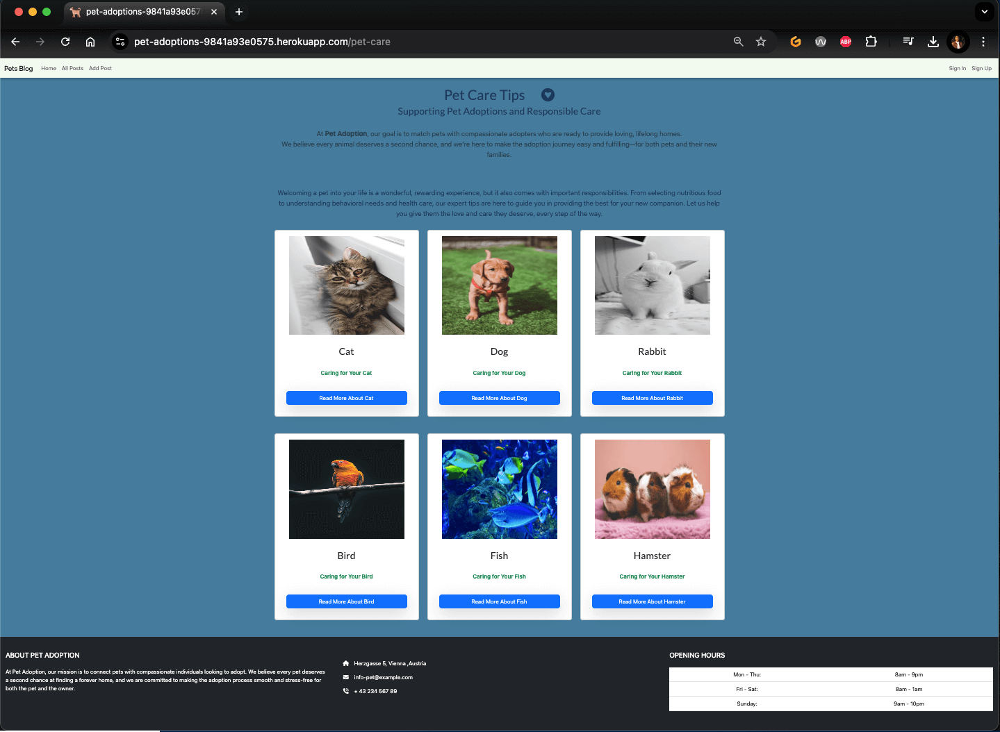

# Pet Adoption - Testing

## Manual Testing

### Test Scenarios for User Stories

#### US01: As a new user, I can create an account so that I can access the pet adoption platform’s features, such as viewing and posting pets for adoption.
[Kanban Board (USER STORY: User Registration)](https://github.com/users/Mustafa-Vienna/projects/6/views/1?pane=issue&itemId=86604167&issue=Mustafa-Vienna%7CPetAdoption%7C5)

| **Test Scenario ID** | **Test Scenario**  | **Steps to Test** | **Expected Result** | **Pass/Fail** | **Screenshots** |
|----------------------|--------------------|-------------------|---------------------|---------------|-----------------|
| US01-TS01 | Verify the registration form loads correctly | Open the registration page and confirm that username, email, and password fields are displayed. Verify the form uses `crispy` forms for layout. | The form is displayed with all fields, using a consistent and responsive layout. | Pass |  |
| US01-TS02 | Test successful registration flow | Submit the form with a valid username, email, and password. | The user is successfully registered, logged in, and redirected to the main page. | Pass |  |
| US01-TS03 | Test duplicate username or email validation | Submit the form with an existing username and/or email. | Error messages are displayed indicating duplicate username or email. | Pass |  |
| US01-TS04 | Test weak password validation | Submit the form with a weak password (e.g., `12345`). | Error message indicates the password is too weak, and registration is rejected. | Pass |  |
| US01-TS05 | Test invalid email format validation | Submit the form with an invalid email (e.g., `user@com` or `user@` or `user@gmailcom`). | Error message indicates an invalid email format, and registration is rejected. | Pass |  |
| US01-TS06 | Test password mismatch validation | Submit the form with mismatched passwords in `password111` and `password222`. | Error message indicates passwords do not match, and registration is rejected. | Pass |  |
| US01-TS07 | Check edge cases | Submit the form with empty fields, long strings, or special characters in the username/email fields. | Error messages are displayed for empty fields. Long strings are handled gracefully without breaking the application. | Pass |  |
| US01-TS08 | Verify user name display on navbar after registration | Complete the registration form as a new user (e.g., `user1`). After redirection to the main page, check the navbar. | The navbar should display "Welcome: user1" for the logged-in user. | Pass |  |
---

#### US02: As a registered user, I can log in to my account so that I can access the platform's features of the application.
[Kanban Board (USER STORY: User Login)](https://github.com/users/Mustafa-Vienna/projects/6/views/1?pane=issue&itemId=86604170&issue=Mustafa-Vienna%7CPetAdoption%7C6)

| **Test Scenario ID** | **Test Scenario**  | **Steps to Test** | **Expected Result** | **Pass/Fail** | **Screenshots** |
|----------------------|--------------------|-------------------|---------------------|---------------|-----------------|
| US02-TS01 | Verify the login form loads correctly | Open the login page and confirm that username and password fields are displayed. Verify the form uses `crispy` forms for layout. | The form is displayed with both fields, using a consistent and responsive layout. | Pass |  |
| US02-TS02 | Test successful login flow | Submit the form with valid credentials (correct username and password). | The user is successfully logged in, redirected to the main page, and their username is displayed in the navbar. | Pass |   |
| US02-TS03 | Test invalid login attempts | Submit the form with incorrect credentials (e.g., wrong password, non-existent username, empty fields). | Error messages are displayed for invalid credentials or empty fields, and login is rejected. | Pass |    |
| US02-TS04 | Test case sensitivity of username and password | Enter a valid username in uppercase/lowercase and verify login behavior. | Login behavior should be case-insensitive for the username but case-sensitive for the password. | Pass |  |
---

#### US03: As a logged-in user, I can log out of my account so that I can securely end my session and prevent unauthorized access to my account.
[Kanban Board (USER STORY: Basic User Logout)](https://github.com/users/Mustafa-Vienna/projects/6/views/1?pane=issue&itemId=86604171&issue=Mustafa-Vienna%7CPetAdoption%7C4)

| **Test Scenario ID** | **Test Scenario**  | **Steps to Test** | **Expected Result** | **Pass/Fail** | **Screenshots** |
|----------------------|--------------------|-------------------|---------------------|---------------|-----------------|
|US03-TS01|Verify the logout option is available|Log in and navigate to any page. Confirm that a "Sign Out" link is visible in the navigation bar.|The "Sign Out" link is visible on all pages when the user is logged in.| Pass |  |
|US03-TS02|Test successful logout flow|Click the "Sign Out" link in the navigation bar.|The user is redirected to the logout confirmation page and sees the "You Have Been Logged Out" message.| Pass |  |
|US03-TS03|Test navbar updates after logout|Log out and check the navigation bar. Verify that "Sign In" and "Sign Up" links replace the "Welcome: username" and "Sign Out" links.|The navigation bar updates correctly to display "Sign In" and "Sign Up" links after logout.|Pass|  |
|US03-TS04|Verify login option on logout page|On the logout page, check for the presence of a link to log in again.|A "Log in again" link is visible and functional on the logout page.|Pass|  |
---

#### US04: As a registered user, I can interact with a consistent layout with a navigation bar, header, and footer on every page.
[Kanban Board (USER STORY: Consistent Site Layout and Dynamic Navigation Bar)](https://github.com/users/Mustafa-Vienna/projects/6/views/1?pane=issue&itemId=86604166&issue=Mustafa-Vienna%7CPetAdoption%7C7)

| **Test Scenario ID** | **Test Scenario** | **Steps to Test** | **Expected Result** | **Pass/Fail** |
|----------------------|-------------------|-------------------|---------------------|---------------|
| US04-TS01 | Verify the consistent layout across pages | Navigate to all pages and check for the presence of the navigation bar, header, and footer. | The navigation bar, header, and footer are consistently displayed across all pages. | Pass |
| US04-TS02 | Verify the personalized welcome message for logged-in users | Log in and navigate to any page. Check that the navigation bar displays a personalized welcome message (e.g., "Welcome, [username]"). | The welcome message is displayed in the navigation bar for logged-in users. | Pass |
| US04-TS03 | Test navigation bar links | Click on navigation bar links (e.g., "Home," "Posts," "Add Post") and verify that they navigate to the correct pages. | All navigation bar links function correctly and navigate to the appropriate pages. | Pass |
---

#### US05: As a user, I can experience a visually cohesive and branded website so that I feel confident in the website’s professionalism and recognize its identity.
[Kanban Board (USER STORY: Consistent Branding and Visual Design)](https://github.com/users/Mustafa-Vienna/projects/6/views/1?pane=issue&itemId=86604164&issue=Mustafa-Vienna%7CPetAdoption%7C9)

| **Test Scenario ID** | **Test Scenario** | **Steps to Test** | **Expected Result** | **Pass/Fail** |
|----------------------|-------------------|-------------------|---------------------|---------------|
| US05-TS01 | Verify the favicon displays correctly | Open the website in a browser and verify the presence of a favicon in the browser tab for all pages. | The favicon is displayed correctly in the browser tab for all pages. | Pass |
| US05-TS02 | Verify consistent site-wide styling | Navigate through all pages and check that the styles are consistent and cohesive. | All pages have consistent styling, ensuring a branded and professional appearance. | Pass |
---

#### US06: As a user, I want to navigate the website easily using a navigation bar so that I can access the main pages, including home, posts, and the option to add a new post.
[Kanban Board (USER STORY: Navigation Bar with Dynamic Links)](https://github.com/users/Mustafa-Vienna/projects/6/views/1?pane=issue&itemId=86604165&issue=Mustafa-Vienna%7CPetAdoption%7C10)

| **Test Scenario ID** | **Test Scenario** | **Steps to Test** | **Expected Result** | **Pass/Fail** |
|----------------------|-------------------|-------------------|---------------------|---------------|
| US06-TS01 | Verify the navigation bar displays correctly | Open the website and confirm that the navigation bar includes links to "Home," "All Posts," and "Add Post." | The navigation bar displays links to "Home," "All Posts," and "Add Post." | Pass |
| US06-TS02 | Test navigation bar link functionality | Click on each navigation link and verify that it navigates to the correct page. | All navigation links function correctly and navigate to the appropriate pages. | Pass |
---

#### US07: As a visitor (not logged in), I can view the index page with all posts but see prompts to sign in or sign up for additional features so that I understand that I need an account to interact fully with the content.

[Kanban Board (USER STORY: Visitor Access with Limited Functionality and Navigation)](https://github.com/users/Mustafa-Vienna/projects/6/views/1?pane=issue&itemId=86604161&issue=Mustafa-Vienna%7CPetAdoption%7C11)

| **Test Scenario ID** | **Test Scenario**  | **Steps to Test** | **Expected Result** | **Pass/Fail** | **Screenshots** |
|----------------------|--------------------|-------------------|---------------------|---------------|-----------------|
|US07-TS01|Verify index page accessibility for visitors|Open the index page as a non-logged-in visitor.|The index page displays all posts with details (title, image, description, timestamp).|Pass|  |
|US07-TS02|Verify navigation bar for visitors|Open the website as a visitor. Check the navigation bar.|The navigation bar displays "Sign In" and "Sign Up" buttons for visitors and hides "Create Post," "Comment," and "Like" options.|Pass|  |
|US07-TS03|Verify navigation to login and registration pages|Click on "Sign In" or "Sign Up" in the navigation bar.|The visitor is redirected to the login or registration page.|Pass|     |

---

#### US08: As a visitor, I want to see a welcome section that introduces the platform so that I understand the purpose and mission of the pet adoption site.

[Kanban Board (USER STORY: Welcome Section)](https://github.com/users/Mustafa-Vienna/projects/6/views/1?pane=issue&itemId=86604160&issue=Mustafa-Vienna%7CPetAdoption%7C12)

|**Test Scenario ID**|**Test Scenario**|**Steps to Test**|**Expected Result**|**Pass/Fail**|
|--------------------|-----------------|-----------------|-------------------|-------------|
|US08-TS01|Verify the presence of a welcome section|Open the index page as a visitor.|The welcome section is displayed with introductory text about the platform’s mission and purpose.|Pass|
|US08-TS02|Verify the visual appeal of the welcome section|Check for the presence of an image in the welcome section.|The welcome section includes a relevant image that enhances visual appeal.|Pass|

---

#### US09: As a visitor, I want to explore options for posting pets, learning pet care tips, and understanding the platform's mission so that I can choose the action that interests me the most.

[Kanban Board (USER STORY: About Section with Interactive Cards)](https://github.com/users/Mustafa-Vienna/projects/6/views/1?pane=issue&itemId=86604159&issue=Mustafa-Vienna%7CPetAdoption%7C13)

| **Test Scenario ID** | **Test Scenario**  | **Steps to Test** | **Expected Result** | **Pass/Fail** | **Screenshots** |
|----------------------|--------------------|-------------------|---------------------|---------------|-----------------|
|US09-TS01|Verify the presence of interactive cards in the about section|Navigate to the about section.|Three cards (Post Your Pet, Pet Care Tips, Our Mission) are displayed with titles, descriptions, and buttons.|Pass|  |
|US09-TS02|Verify hover effects on cards|Hover over each card in the about section.|Each card displays a hover effect for visual engagement.|Pass|  |
|US09-TS03|Verify button functionality on cards|Click on the button for each card.|Each button navigates to its specific page: Post Your Pet, Pet Care Tips, or Our Mission.|Pass|      |

---

#### US10: As a visitor, I want to see the latest pet posts and articles so that I can explore recent content on pet adoption.

[Kanban Board (USER STORY: Latest Posts Section)](https://github.com/users/Mustafa-Vienna/projects/6/views/1?pane=issue&itemId=86604157&issue=Mustafa-Vienna%7CPetAdoption%7C14)

|**Test Scenario ID**|**Test Scenario**|**Steps to Test**|**Expected Result**|**Pass/Fail**|
|--------------------|-----------------|-----------------|-------------------|-------------|
|US10-TS01|Verify the display of the latest posts|Navigate to the homepage as a visitor.|Three recent posts with images, descriptions, and timestamps are displayed in the latest posts section.|Pass|
|US10-TS02|Verify clickable post cards|Click on a post card in the latest posts section.|The user is redirected to the respective post’s detailed page.|Pass|
|US10-TS03|Verify "View All Posts" link|Click the "View All Posts" link in the latest posts section.|The user is redirected to the full posts page.|Pass|

---

#### US11: As a visitor, I want to read testimonials from other users so that I can see feedback and build trust in the platform.

[Kanban Board (USER STORY: Testimonials Section)](https://github.com/users/Mustafa-Vienna/projects/6/views/1?pane=issue&itemId=86604158&issue=Mustafa-Vienna%7CPetAdoption%7C15)

|**Test Scenario ID**|**Test Scenario**|**Steps to Test**|**Expected Result**|**Pass/Fail**|
|--------------------|-----------------|-----------------|-------------------|-------------|
|US11-TS01|Verify the display of testimonials|Navigate to the testimonials section on the homepage.|The testimonials section displays user names and their feedback messages.|Pass|
|US11-TS02|Verify readability of testimonials|Inspect the layout and style of the testimonials.|Each testimonial is styled for readability.|Pass|

---

#### US12: As a visitor, I want to see a footer with contact information, opening hours, and social media links so that I can easily find additional resources and learn about the organization.

[Kanban Board (USER STORY: Footer with Site Information and Links)](https://github.com/users/Mustafa-Vienna/projects/6/views/1?pane=issue&itemId=86604155&issue=Mustafa-Vienna%7CPetAdoption%7C16)

|**Test Scenario ID**|**Test Scenario**|**Steps to Test**|**Expected Result**|**Pass/Fail**|
|--------------------|-----------------|-----------------|-------------------|-------------|
|US12-TS01|Verify the footer displays contact information|Scroll to the footer section on any page.|The footer displays the organization’s address, contact information, and opening hours.|Pass|
|US12-TS02|Verify social media links in the footer|Inspect the social media links in the footer and click them.|The social media links open the respective platform pages in new tabs.|Pass|
|US12-TS03|Verify copyright information in the footer|Inspect the bottom of the footer for copyright information.|The footer displays copyright information clearly at the bottom.|Pass|

---

#### US13: As a registered user, I want to navigate to the Add Post page from both the navigation bar and the "Post Your Pet" card in the about section so that I can easily post a pet for adoption.

[Kanban Board (USER STORY: Access Add Post Page via Navbar and About Section)](https://github.com/users/Mustafa-Vienna/projects/6/views/1?pane=issue&itemId=86604156&issue=Mustafa-Vienna%7CPetAdoption%7C17)

|**Test Scenario ID**|**Test Scenario**|**Steps to Test**|**Expected Result**|**Pass/Fail**|
|--------------------|-----------------|-----------------|-------------------|-------------|
|US13-TS01|Verify navigation bar link to Add Post page|Log in as a registered user and click the "Add Post" link in the navigation bar.|The user is redirected to the post creation page.|Pass|
|US13-TS02|Verify "Post Your Pet" card button functionality|Log in as a registered user and click the "Publish Post" button on the "Post Your Pet" card in the about section.|The user is redirected to the post creation page.|Pass|
|US13-TS03|Verify the post creation form fields|Navigate to the Add Post page and inspect the form fields.|The form contains fields for title, pet_name, pet_age, excerpt, image, and content.|Pass|
|US13-TS04|Verify the Publish button functionality|Fill out the post creation form and click the "Publish" button.|The post is successfully saved and visible on the homepage.|Pass|
|US13-TS05|Verify required field validations|Submit the post creation form with missing required fields.|Error messages are displayed for all required fields that are left empty.|Pass|

---

#### US14: As a visitor, I can view the full details of a post so that I can learn more about the pet and adoption information.

[Kanban Board (USER STORY: View Full Post Details)](https://github.com/users/Mustafa-Vienna/projects/6/views/1?pane=issue&itemId=86662400&issue=Mustafa-Vienna%7CPetAdoption%7C18)

|**Test Scenario ID**|**Test Scenario**|**Steps to Test**|**Expected Result**|**Pass/Fail**|
|--------------------|-----------------|-----------------|-------------------|-------------|
|US14-TS01|Verify post detail page displays complete content|Navigate to the post detail page as a visitor.|The page displays the image, title, pet details (e.g., name, age), and full description.|Pass|
|US14-TS02|Verify accessibility of post detail page for visitors|Access a post detail page without logging in.|The post detail page is accessible without requiring login.|Pass|

---

#### US15: As a visitor, I want to see prompts to sign in or sign up to interact with the post so that I know that I need an account to like or comment on the post.

[Kanban Board (USER STORY: Prompts to Sign In or Sign Up for Interaction)](https://github.com/users/Mustafa-Vienna/projects/6/views/1?pane=issue&itemId=86662399&issue=Mustafa-Vienna%7CPetAdoption%7C19)

|**Test Scenario ID**|**Test Scenario**|**Steps to Test**|**Expected Result**|**Pass/Fail**|
|--------------------|-----------------|-----------------|-------------------|-------------|
|US15-TS01|Verify navigation bar prompts for visitors|Open the website as a visitor and check the navigation bar.|The navigation bar displays "Sign In" and "Sign Up" links for visitors.|Pass|
|US15-TS02|Verify "Sign In to Like" prompt for visitors|Check the area near the like button on a post detail page.|A "Sign In to Like" prompt is displayed, indicating sign-in is required to like the post.|Pass|
|US15-TS03|Verify sign-in prompts in the comment section|Navigate to the "Leave Your Comment" section on the post detail page.|A message with "Sign In" and "Sign Up" links is displayed, encouraging visitors to log in or register to comment.|Pass|

---

#### US16: As a visitor, I want to return to the post detail page after signing in or registering so that I can continue viewing or interacting with the post where I left off.

[Kanban Board (USER STORY: Redirect Back to Post After Sign In or Sign Up)](https://github.com/users/Mustafa-Vienna/projects/6/views/1?pane=issue&itemId=86662395&issue=Mustafa-Vienna%7CPetAdoption%7C20)

|**Test Scenario ID**|**Test Scenario**|**Steps to Test**|**Expected Result**|**Pass/Fail**|
|--------------------|-----------------|-----------------|-------------------|-------------|
|US16-TS01|Verify redirect back to post detail page after login|Attempt to like or comment on a post as a visitor. Complete the login process.|The user is redirected back to the same post detail page after login.|Pass|
|US16-TS02|Verify redirect back to post detail page after registration|Attempt to like or comment on a post as a visitor. Complete the registration process.|The user is redirected back to the same post detail page after registration.|Pass|
|US16-TS03|Verify interactive features after login/registration|Log in or register from a post detail page and check interactive features.|The "Like" and "Leave a Comment" features are enabled for the newly logged-in user.|Pass|

---

#### US17: As a visitor, I can access the login or registration page from multiple sections on the post detail page so that I can quickly sign in or sign up from wherever I am prompted.

[Kanban Board (USER STORY: Navigation to Login or Register from Different Sections)](https://github.com/users/Mustafa-Vienna/projects/6/views/1?pane=issue&itemId=86662396&issue=Mustafa-Vienna%7CPetAdoption%7C21)

|**Test Scenario ID**|**Test Scenario**|**Steps to Test**|**Expected Result**|**Pass/Fail**|
|--------------------|-----------------|-----------------|-------------------|-------------|
|US17-TS01|Verify navigation bar links for login and registration|Check the navigation bar on the post detail page as a visitor.|The navigation bar displays "Sign In" and "Sign Up" links.|Pass|
|US17-TS02|Verify login and registration prompts on post detail card|Check the post detail card as a visitor.|"Sign In" and "Sign Up" prompts are visible for visitors.|Pass|
|US17-TS03|Verify "Sign In" prompt near the like button|Inspect the like button area as a visitor.|A "Sign In" prompt is displayed instead of the like button for visitors.|Pass|
|US17-TS04|Verify redirects to post detail page after login/registration|Click on any "Sign In" or "Sign Up" link, complete the process, and check the page.|The user is redirected back to the post detail page after logging in or registering.|Pass|

---

#### US18: As a logged-in user, I want to like the post and see an updated like count and message so that I know how many others liked the post and see my interaction.

[Kanban Board (USER STORY: View and Interact with Post as a Logged-In User)](https://github.com/users/Mustafa-Vienna/projects/6/views/1?pane=issue&itemId=86662398&issue=Mustafa-Vienna%7CPetAdoption%7C22)

|**Test Scenario ID**|**Test Scenario**|**Steps to Test**|**Expected Result**|**Pass/Fail**|
|--------------------|-----------------|-----------------|-------------------|-------------|
|US18-TS01|Verify initial like button state for logged-in users|Check the like button on the post detail page.|The like button appears as a gray heart if the user hasn’t liked the post.|Pass|
|US18-TS02|Verify like functionality updates icon and count|Click the gray heart icon as a logged-in user.|The icon changes to a red heart, and the like count is incremented.|Pass|
|US18-TS03|Verify like count messages when no one has liked the post|View the like count message on a post with no likes.|The message displays: "0 users like this post."|Pass|
|US18-TS04|Verify like count message when the logged-in user is the first to like|Like a post that has no likes.|The message displays: "1 - You like this post."|Pass|
|US18-TS05|Verify like count message when the logged-in user and one other person have liked|Like a post that already has one like.|The message displays: "2 - You and 1 other user like this post."|Pass|
|US18-TS06|Verify like count message when the logged-in user and multiple others have liked|Like a post that already has multiple likes.|The message displays: "You and X other users like this post." where X is the number of additional users.|Pass|
|US18-TS07|Verify like count message when only one other user has liked the post|View a post with one like from another user.|The message displays: "1 user likes this post."|Pass|
|US18-TS08|Verify like count message when multiple users (excluding logged-in user) have liked|View a post with multiple likes from other users.|The message displays: "X users like this post." where X is the total number of other users.|Pass|

---

#### US19: As a post owner, I want to update or delete my post so that I can manage my content effectively.

[Kanban Board (USER STORY: Ownership Controls for Post Owner)](https://github.com/users/Mustafa-Vienna/projects/6/views/1?pane=issue&itemId=86662397&issue=Mustafa-Vienna%7CPetAdoption%7C23)

|**Test Scenario ID**|**Test Scenario**|**Steps to Test**|**Expected Result**|**Pass/Fail**|
|--------------------|-----------------|-----------------|-------------------|-------------|
|US19-TS01|Verify visibility of update and delete buttons for post owner|Log in as the post owner and navigate to the post detail page.|"Update Post" and "Delete Post" buttons are visible only for the post owner.|Pass|
|US19-TS02|Verify absence of update and delete buttons for non-owners|Log in as a non-owner or view as a visitor and navigate to the post detail page.|The "Update Post" and "Delete Post" buttons are not visible to non-owners or visitors.|Pass|
|US19-TS03|Verify delete functionality|Click the "Delete Post" button, confirm the action, and check the posts list.|The post is removed from the list after deletion.|Pass|
|US19-TS04|Verify update functionality|Click the "Update Post" button, modify the post details, and save.|The post details are updated successfully.|Pass|

---

#### US20: As a logged-in user, I want to see community feedback, including comments from other users, with details so that I can read what others have shared about the post.

[Kanban Board (USER STORY: Community Feedback Display)](https://github.com/users/Mustafa-Vienna/projects/6/views/1?pane=issue&itemId=86662394&issue=Mustafa-Vienna%7CPetAdoption%7C24)

|**Test Scenario ID**|**Test Scenario**|**Steps to Test**|**Expected Result**|**Pass/Fail**|
|--------------------|-----------------|-----------------|-------------------|-------------|
|US20-TS01|Verify community feedback section for no comments|Check the "Community Feedback" section on a post with no comments.|The message "Be the first to share your thoughts on this post" is displayed.|Pass|
|US20-TS02|Verify display of existing comments|Check the "Community Feedback" section on a post with comments.|Comments are displayed with the author’s name, date-time, and comment text.|Pass|

---

#### US21: As a logged-in user, I want to see a comment form pre-filled with my username so that I can easily write and publish my comment on the post.

[Kanban Board (USER STORY: Leave Your Comment Section for Logged-In Users)](https://github.com/users/Mustafa-Vienna/projects/6/views/1?pane=issue&itemId=86662393&issue=Mustafa-Vienna%7CPetAdoption%7C25)

|**Test Scenario ID**|**Test Scenario**|**Steps to Test**|**Expected Result**|**Pass/Fail**|
|--------------------|-----------------|-----------------|-------------------|-------------|
|US21-TS01|Verify pre-filled username in the comment form|Log in and check the "Leave Your Comment" section on a post detail page.|The form displays the logged-in user’s name above the text area.|Pass|
|US21-TS02|Verify functionality of the comment form|Write a comment in the text area and submit the form.|The comment is published and displayed in the "Community Feedback" section.|Pass|

---

#### US22: As a user, I want to browse all posts on the All Posts page with six posts per page and pagination controls so that I can view content in an organized way with easy navigation across pages.

[Kanban Board (USER STORY: View All Posts with Pagination and Consistent Layout)](https://github.com/users/Mustafa-Vienna/projects/6/views/1?pane=issue&itemId=86662832&issue=Mustafa-Vienna%7CPetAdoption%7C26)

|**Test Scenario ID**|**Test Scenario**|**Steps to Test**|**Expected Result**|**Pass/Fail**|
|--------------------|-----------------|-----------------|-------------------|-------------|
|US22-TS01|Verify pagination controls on All Posts page|Navigate to the All Posts page.|The page displays six posts per page with "Next" and "Previous" buttons.|Pass|
|US22-TS02|Verify navigation between pages|Click the "Next" or "Previous" buttons.|The user is navigated to the respective pages.|Pass|

---

#### US23: As a user, I want the All Posts page layout to adjust based on screen size so that I can view posts optimally on any device.

[Kanban Board (USER STORY: Responsive Layout for All Posts Page)](https://github.com/users/Mustafa-Vienna/projects/6/views/1?pane=issue&itemId=86662833&issue=Mustafa-Vienna%7CPetAdoption%7C27)

|**Test Scenario ID**|**Test Scenario**|**Steps to Test**|**Expected Result**|**Pass/Fail**|
|--------------------|-----------------|-----------------|-------------------|-------------|
|US23-TS01|Verify layout on large screens|View the All Posts page on a large screen.|The page displays posts in two rows with three posts per row.|Pass|
|US23-TS02|Verify layout on medium screens|View the All Posts page on a medium screen.|The page displays posts in three rows with two posts per row.|Pass|
|US23-TS03|Verify layout on small screens|View the All Posts page on a small screen.|The page displays one post per row.|Pass|

---

#### US24: As a user, I can see a custom 404 error page when accessing a non-existent URL so that I know the page doesn’t exist and can navigate back to a functional area of the website.

[Kanban Board (USER STORY: Custom 404 Error Page)](https://github.com/users/Mustafa-Vienna/projects/6/views/1?pane=issue&itemId=86604162&issue=Mustafa-Vienna%7CPetAdoption%7C8)

|**Test Scenario ID**|**Test Scenario**|**Steps to Test**|**Expected Result**|**Pass/Fail**|
|--------------------|-----------------|-----------------|-------------------|-------------|
|US24-TS01|Verify custom 404 error page display|Navigate to a non-existent URL.|The 404 error page is displayed with a message like "Oops! This page doesn't exist."|Pass|
|US24-TS02|Verify homepage link on 404 error page|Click the homepage link on the 404 error page.|The user is redirected to the homepage.|Pass|
|US24-TS03|Verify consistency of 404 page layout|Inspect the layout of the 404 error page.|The 404 page uses the base.html template for consistent styling.|Pass|